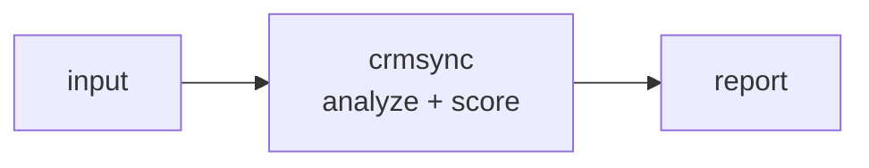

<a name="top"></a>
<div align="center">


# CRMSYNC

### Bidirectional, idempotent sync of contacts/deals between a local SQLite source-of-truth and CRM APIs (HubSpot/Pipedrive/Salesforce) via one config.


[](https://pypi.org/project/cognis-crmsync/) [](https://github.com/cognis-digital/crmsync/actions) [](LICENSE) [](https://github.com/cognis-digital)

*Part of the Cognis Neural Suite.*

</div>

```bash
pip install cognis-crmsync
crmsync scan .            # → prioritized findings in seconds
```

## Usage — step by step

1. Install the CLI (Python 3.9+):

   ```bash
   pip install crmsync        # or: pip install .   from a checkout
   ```

2. Detect drift — the `diff` subcommand compares a versioned CRM export (CSV/TSV/JSON) against a local SQLite store and exits `1` when they differ:

   ```bash
   crmsync diff contacts.csv --db crm.db --table contacts --key email
   ```

3. Sync the DB to match the export (idempotent) with `apply`:

   ```bash
   crmsync apply contacts.csv --db crm.db --table contacts --key email
   ```

   Add `--no-delete` to keep DB rows that are absent from the export.

4. Read drift programmatically with the global `--format json` flag (it precedes the subcommand):

   ```bash
   crmsync --format json diff deals.json --db crm.db --key deal_id | jq .
   ```

5. Gate CI on CRM consistency — the job fails (exit 1) whenever the export and DB drift apart:

   ```bash
   crmsync diff contacts.csv --db crm.db --key email || echo "CRM export drifted from DB"
   ```


## Contents

- [Why crmsync?](#why) · [Features](#features) · [Quick start](#quick-start) · [Example](#example) · [Architecture](#architecture) · [AI stack](#ai-stack) · [How it compares](#how-it-compares) · [Integrations](#integrations) · [Install anywhere](#install-anywhere) · [Related](#related) · [Contributing](#contributing)

<a name="why"></a>
## Why crmsync?

A single MCP-native binary that makes your CRM a replica of a versioned local file — run it in CI to detect drift and reconcile without a $20k iPaaS contract.

`crmsync` is single-purpose, scriptable, and self-hostable: point it at a target, get prioritized results in the format your workflow already speaks (table · JSON · SARIF), gate CI on it, and let agents drive it over MCP.

<div align="right"><a href="#top">↑ back to top</a></div>

<a name="features"></a>
## Features

- ✅ Fingerprint
- ✅ Load Export
- ✅ Ensure Schema
- ✅ Load Db State
- ✅ Diff Records
- ✅ Apply Plan
- ✅ Runs on Linux/macOS/Windows · Docker · devcontainer
- ✅ Ports in Python, JavaScript, Go, and Rust (`ports/`)

<div align="right"><a href="#top">↑ back to top</a></div>

<a name="quick-start"></a>
## Quick start

```bash
pip install cognis-crmsync
crmsync --version
crmsync scan .                       # scan current project
crmsync scan . --format json         # machine-readable
crmsync scan . --fail-on high        # CI gate (non-zero exit)
```

<div align="right"><a href="#top">↑ back to top</a></div>

<a name="example"></a>
## Example

```text
$ crmsync scan .
  [HIGH    ] CRM-001  example finding             (./src/app.py)
  [MEDIUM  ] CRM-002  another signal              (./config.yaml)

  2 findings · risk score 5 · 38ms
```

<div align="right"><a href="#top">↑ back to top</a></div>

<a name="architecture"></a>
## Architecture



<div align="right"><a href="#top">↑ back to top</a></div>

<a name="ai-stack"></a>
## Use it from any AI stack

`crmsync` is interoperable with every popular way of using AI:

- **MCP server** — `crmsync mcp` (Claude Desktop, Cursor, Cognis.Studio, [uncensored-fleet](https://github.com/cognis-digital/uncensored-fleet))
- **OpenAI-compatible / JSON** — pipe `crmsync scan . --format json` into any agent or LLM
- **LangChain · CrewAI · AutoGen · LlamaIndex** — wrap the CLI/JSON as a tool in one line
- **CI / scripts** — exit codes + SARIF for non-AI pipelines

<div align="right"><a href="#top">↑ back to top</a></div>

<a name="how-it-compares"></a>
## How it compares

| | **Cognis crmsync** | Airbyte |
|---|:---:|:---:|
| Self-hostable, no account | ✅ | varies |
| Single command, zero config | ✅ | ⚠️ |
| JSON + SARIF for CI | ✅ | varies |
| MCP-native (AI agents) | ✅ | ❌ |
| Polyglot ports (JS/Go/Rust) | ✅ | ❌ |
| Open license | ✅ COCL | varies |

*Built in the spirit of **Airbyte/Singer taps, in the spirit of Grouparoo**, re-framed the Cognis way. Missing a credit? Open a PR.*

<div align="right"><a href="#top">↑ back to top</a></div>

<a name="integrations"></a>
## Integrations

Pipes into your stack: **SARIF** for code-scanning, **JSON** for anything, an **MCP server** (`crmsync mcp`) for AI agents, and a webhook forwarder for SIEM/Slack/Jira. See [`docs/INTEGRATIONS.md`](docs/INTEGRATIONS.md).

<div align="right"><a href="#top">↑ back to top</a></div>

<a name="install-anywhere"></a>
## Install — every way, every platform

```bash
pip install "git+https://github.com/cognis-digital/crmsync.git"    # pip (works today)
pipx install "git+https://github.com/cognis-digital/crmsync.git"   # isolated CLI
uv tool install "git+https://github.com/cognis-digital/crmsync.git" # uv
pip install cognis-crmsync                                          # PyPI (when published)
docker run --rm ghcr.io/cognis-digital/crmsync:latest --help        # Docker
brew install cognis-digital/tap/crmsync                             # Homebrew tap
curl -fsSL https://raw.githubusercontent.com/cognis-digital/crmsync/main/install.sh | sh
```

| Linux | macOS | Windows | Docker | Cloud |
|---|---|---|---|---|
| `scripts/setup-linux.sh` | `scripts/setup-macos.sh` | `scripts/setup-windows.ps1` | `docker run ghcr.io/cognis-digital/crmsync` | [DEPLOY.md](docs/DEPLOY.md) (AWS/Azure/GCP/k8s) |

<div align="right"><a href="#top">↑ back to top</a></div>

<a name="related"></a>
## Related Cognis tools

- [`warmline`](https://github.com/cognis-digital/warmline) — Score and rank inbound/outbound leads from a YAML rulebook, emitting a ranked queue as JSON/CSV for your SDRs and CI gates.
- [`coldforge`](https://github.com/cognis-digital/coldforge) — Render personalized cold-outreach sequences from Markdown templates + a contacts CSV, with spam-score linting and per-send dry-run preview.
- [`pactgen`](https://github.com/cognis-digital/pactgen) — Generate branded sales proposals and SOWs from a YAML scope file + pricing table into PDF/HTML, with a deterministic line-item math check.
- [`dripcheck`](https://github.com/cognis-digital/dripcheck) — Lint email sequences and drip campaigns for deliverability: SPF/DKIM/DMARC, link health, unsubscribe presence, and CAN-SPAM/GDPR compliance.
- [`dealflow`](https://github.com/cognis-digital/dealflow) — Model your sales pipeline as a YAML state machine and compute conversion rates, stage velocity, and weighted forecast straight from CRM exports.
- [`introbot`](https://github.com/cognis-digital/introbot) — Find warm-intro paths through your team's combined network graph and draft double-opt-in intro requests from a single contacts manifest.

**Explore the suite →** [🗂️ all 170+ tools](https://github.com/cognis-digital/cognis-neural-suite) · [⭐ awesome-cognis](https://github.com/cognis-digital/awesome-cognis) · [🔗 cognis-sources](https://github.com/cognis-digital/cognis-sources) · [🤖 uncensored-fleet](https://github.com/cognis-digital/uncensored-fleet) · [🧠 engram](https://github.com/cognis-digital/engram)

<div align="right"><a href="#top">↑ back to top</a></div>

<a name="contributing"></a>
## Contributing

PRs, new rules, and demo scenarios are welcome under the collaboration-pull model — see [CONTRIBUTING.md](CONTRIBUTING.md) and [SECURITY.md](SECURITY.md).

> ### ⭐ If `crmsync` saved you time, **star it** — it genuinely helps others find it.

## Interoperability

`{}` composes with the 300+ tool Cognis suite — JSON in/out and a shared
OpenAI-compatible `/v1` backbone. See **[INTEROP.md](INTEROP.md)** for the
suite map, composition patterns, and reference stacks.

## License

Source-available under the **Cognis Open Collaboration License (COCL) v1.0** — free for personal, internal-evaluation, research, and educational use; **commercial / production use requires a license** (licensing@cognis.digital). See [LICENSE](LICENSE).

---

<div align="center"><sub><b><a href="https://cognis.digital">Cognis Digital</a></b> · one of 170+ tools in the <a href="https://github.com/cognis-digital/cognis-neural-suite">Cognis Neural Suite</a> · <i>Making Tomorrow Better Today</i></sub></div>
